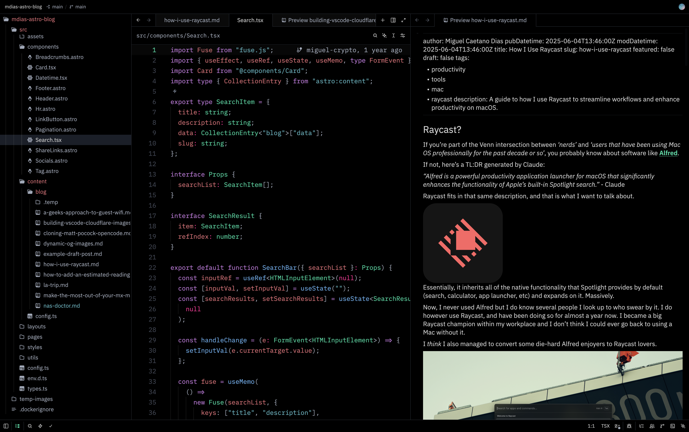
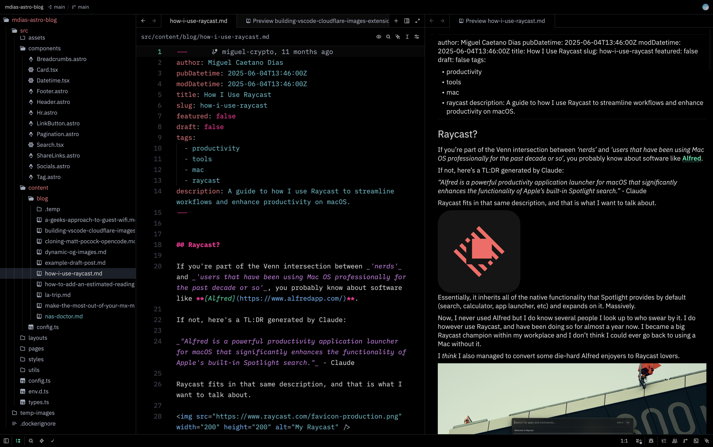

# Mdias OLED for Zed

A pure-black, OLED-friendly Zed theme inspired by vaporwave. Marine teal primary, vibrant green-cyan accents, hot pink highlights, soft gray text. A Zed port of [opencode-vaporware-oled-theme](https://github.com/mcdays94/opencode-vaporware-oled-theme) so the two editors share the same color vocabulary.

<p align="center">
  
</p>

## Markdown side-by-side

Source on the left, rendered preview on the right. Hot pink headings, italic emphasis, marine teal code spans.

<p align="center">
  
</p>

## Palette

| Role | Color | Hex |
|------|-------|-----|
| Background | OLED black | `#000000` |
| Foreground | Soft gray | `#d4d4d4` |
| Primary (strings, success, diff added) | Marine teal | `#56b6c2` |
| Accent (types, links, info, active line number) | Vibrant green-cyan | `#00d9a0` |
| Highlight (warnings, modifications, numbers, headings) | Hot pink | `#ff2094` |
| Comments, muted text | Gray | `#5c6370` |
| Keywords, operators | Magenta | `#c678dd` |
| Functions, tags, attributes | Blue | `#61afef` |
| Properties, variables, errors, diff removed | Soft red | `#e06c75` |

The hot pink is the signature. It appears anywhere Zed flags something worth your attention: search matches, git-modified files, numbers and booleans in code, markdown headings, warnings, the version-control modified marker. Comments render in italic gray for a vaporwave feel.

## Installation

### Via the Zed extension marketplace

`cmd-shift-x` to open the extensions panel and search for **Mdias OLED**.

### Direct install (development)

1. Clone this repo:

   ```bash
   git clone https://github.com/mcdays94/zed-vaporware-oled-theme.git
   cd zed-vaporware-oled-theme
   ```

2. Symlink the theme into your Zed user themes directory:

   ```bash
   mkdir -p ~/.config/zed/themes
   ln -s "$(pwd)/themes/mdias-oled.json" ~/.config/zed/themes/mdias-oled.json
   ```

3. Pick it with `cmd-k cmd-t` and choose **Mdias OLED**, or set it in `~/.config/zed/settings.json`:

   ```json
   {
     "theme": {
       "mode": "dark",
       "dark": "Mdias OLED"
     }
   }
   ```

Zed reloads themes on save, so any edits to `themes/mdias-oled.json` show up instantly.

## Companion theme

The Zed counterpart to [mcdays94/opencode-vaporware-oled-theme](https://github.com/mcdays94/opencode-vaporware-oled-theme). Same palette, same vibe. Run them together for a consistent look across your terminal AI workflow (opencode) and your editor (Zed).

## Inspiration

Vaporwave aesthetics. Neon cyans and hot pinks against pure OLED black. Late-night coding vibes.

## License

MIT
